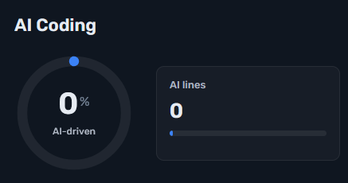

<!-- 🌌 TOP BANNER -->

<p align="center">
  
</p>

<p align="center">
  
</p>


## 🧠 Tech Background

👷 Independent Software Contractor **5y** | Freelancer at an Italian-Bulgarian company **1y**  
👨‍🎓 Graduated from a profesional school with programming with **hands-on projects and industrial practice** at [Melexis](https://www.melexis.com/) , [Schwarz IT](https://www.schwarz-it.com/en/) , [A1](https://www.a1.bg/bg)  
🛠️ Hobbying with game dev and blackboxing   
💻 Currently exploring: 
&nbsp;


## 🛠️ Tools

<p align="left">
  &nbsp;
  &nbsp;
  &nbsp;
  &nbsp;
  &nbsp;
  &nbsp;
  &nbsp;
  &nbsp;
  &nbsp;
  &nbsp;
  &nbsp;
  &nbsp;
  &nbsp;
</p>  
  
## 📊 GitHub Stats

<!--    Graph   h=195  -->

<p align="center">
    
</p> 

<!--   Core stats(Grade) and Language summary     -->

<p align="center">
  
  
</p>


<!--   Trophies  ,GitHub Streak and Total Contributions   -->

<p align="center">
  
  
</p>

<!-- Leetcode --> 
<p align="center">  
  
</p>


<!--  Project Highlights   -->
## 🎭 Project highlights 
<p align="center">  
  <a href="https://github.com/Levoxyl/CTM">
    
  </a>
  <a  href="https://github.com/Levoxyl/AetherUI">
    
  </a>
    <!--  -->
</p>


<!--   Badges    -->

<p align="center">
  
  
  
  
  
  
  
  
  
  
  
  
  
</p>
<!-- Prussian theme is also nice -->

## ⏱️ WakaTime Active Coding Activity

"Active coding" means that WakaTime doesn't measure time spend in the IDE/Code editor, based on the amount of time that the software's window has been opened, but the lines of hand-written code based on their character length calculated into an equivalent astronomical time.

<!--START_SECTION:waka-->

```txt
From: 20 March 2026 - To: 19 June 2026

Total Time: 38 hrs 44 mins

TypeScript   20 hrs 33 mins        █████████████▒░░░░░░░░░░░   52.88 %
Python       12 hrs 44 mins        ████████▒░░░░░░░░░░░░░░░░   32.77 %
JavaScript   3 hrs 20 mins         ██░░░░░░░░░░░░░░░░░░░░░░░   08.61 %
JSON         1 hr 3 mins           ▓░░░░░░░░░░░░░░░░░░░░░░░░   02.74 %
CSS          18 mins               ▒░░░░░░░░░░░░░░░░░░░░░░░░   00.78 %
TSConfig     12 mins               ░░░░░░░░░░░░░░░░░░░░░░░░░   00.53 %
Bash         9 mins                ░░░░░░░░░░░░░░░░░░░░░░░░░   00.43 %
Other        8 mins                ░░░░░░░░░░░░░░░░░░░░░░░░░   00.35 %
Markdown     6 mins                ░░░░░░░░░░░░░░░░░░░░░░░░░   00.27 %
Git Config   6 mins                ░░░░░░░░░░░░░░░░░░░░░░░░░   00.27 %
```

<!--END_SECTION:waka-->


<p align="center">
  
</p>

<p align="left">
  
</p>


<!--TESTS-->


